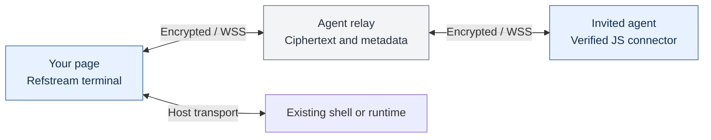

# Refstream.js

A standalone JavaScript terminal emulator. Refstream owns the VT parser, screen
buffers, Unicode cells, input protocols and virtualized browser renderer. Use
`Terminal` wherever your application needs to render a shell or terminal process.
It has **zero runtime dependencies** and does not use xterm.js to render.

The optional `refstream.js/files` module adds backed file references and WebRTC
streams. It is an extension to Refstream's terminal, not the main library.

**Alpha:** available as compiled browser JavaScript and a packable npm project.
The npm package is not published yet. Refstream replaces the renderer, but does
not yet match every xterm sequence or addon. See [compatibility](#compatibility-and-validation).

[Get started](#use-in-a-browser) · [Agent sessions](docs/agents.md) ·
[Files and streams](docs/files.md) · [Security and E2EE](docs/security.md)

## End-to-end encrypted agent connections

**Commands, terminal output and handoff answers are encrypted between the page
and the invited agent's connector.** The hosted or self-hosted agent relay
forwards ciphertext; the encryption key is created in the page and shared only
through the private invitation. E2EE is built into this connection, with no
plaintext fallback.



The page, connector and invited agent can read the shared data. The relay sees
IP addresses, the page origin, timing and frame sizes. The agent's chat or tool
provider may receive and retain the invitation and terminal data passed through
its tools. Your shell backend, file providers and saved snapshots have separate security boundaries; embedding
Refstream does not encrypt those automatically. Read the
[encryption and trust model](docs/security.md) for exact coverage and limits.

## Use in a browser

Download the compiled JavaScript and CSS from
[Releases](https://github.com/TeoSlayer/refstream.js/releases), or build with
`npm ci && npm run build`. Serve the browser files on any static host. Keep the
`chunks/` directory alongside the JavaScript files.
Consumers need only JavaScript and CSS, with no framework, Node.js or build step.
The optional agent connector runs separately and requires Node.js 22+.

```html
<link rel="stylesheet" href="/sdk/refstream.css">
<div id="terminal" style="height:400px"></div>
<script type="module">
  import { Terminal } from '/sdk/refstream.js';

  const terminal = new Terminal({ theme: 'midnight', fontSize: 14 });
  terminal.open(document.querySelector('#terminal'));
  terminal.fit();
  terminal.write('Hello, \x1b[32mworld\x1b[0m!\r\n');
</script>
```

For classic script tags, load `refstream.global.js` and use
`new Refstream.Terminal(options)`. The browser modules and global are built from
the same terminal engine.

Serve versioned files together, including CSS, `chunks/` and the MIT license.
Use the checksum supplied with a release to verify its archive. Do not overwrite
an existing version's assets. Modules need a JavaScript MIME type and, when served
from another origin, appropriate CORS headers. Missing module paths must return
404 rather than the site's HTML fallback.

For bundlers, build a checkout and run `npm pack`, then install the resulting
tarball into your application. The package imports below use that distribution;
they do not require an npm registry publication. ESM, CommonJS, declarations,
CSS and source maps are included. No install scripts run for consumers.

## Replace xterm in an application

The main API follows familiar terminal conventions: `new Terminal(options)`,
`open`, `write`, `onData`, `onBinary`, `onResize`, `resize`, `focus`, selection,
scrolling and `dispose`. Refstream also includes `fit()` directly.

```js
import { Terminal } from 'refstream.js';
import 'refstream.js/style.css';

const terminal = new Terminal({ cols: 80, rows: 24, scrollback: 10_000 });
terminal.open(container);

// Keep your application's authenticated PTY transport.
const input = terminal.onData(data => transport.send(new TextEncoder().encode(data)));
const binary = terminal.onBinary(data => transport.send(
  Uint8Array.from(data, character => character.charCodeAt(0)),
));
const resize = terminal.onResize(({ cols, rows }) => transport.resize(cols, rows));
const output = transport.onOutput(bytes => terminal.write(bytes));

const observer = new ResizeObserver(() => terminal.fit());
observer.observe(container);
terminal.fit();
terminal.focus();

// This example's transport returns a disposable output subscription.
function dispose() {
  observer.disconnect();
  output.dispose(); input.dispose(); binary.dispose(); resize.dispose();
  terminal.dispose();
}
```

`container` and `transport` above belong to your application. Like other terminal
emulators, Refstream displays terminal output and emits input; your PTY or browser
runtime executes commands. Refstream does not install a server or choose one.

**Version 0.1 alpha:** the terminal works independently of xterm. Compatibility
with every xterm escape sequence and addon is not complete. Applications using
xterm addons or private APIs need to adapt them; this is not binary compatibility
with its addon ecosystem. The package includes xterm only as a development test
dependency to compare terminal behavior.

## Terminal features

- Normal and alternate screen buffers, bounded scrollback, resize and reflow,
  cursor movement, colors and text attributes, scrolling regions and tab stops.
- Streaming UTF-8, wide characters and combining sequences; keyboard input,
  IME composition, bracketed paste, selection, mouse reporting and touch input.
- Virtualized DOM rows, native scrolling, batched painting, eight built-in themes
  and runtime appearance options.
- Command markers, searchable output, session snapshots and recording/replay.
- HTTP(S) links and opt-in file previews with a host-provided source of bytes.

`write()` updates the model synchronously and batches painting into an animation
frame. Its callback runs after parsing, not after display refresh. Use `onRender`
to observe rendering. Chunk large output streams and yield between writes to
keep browser input responsive.

## State, search and replay

```js
import { getTerminalSession, findInTerminal, terminalTranscript } from 'refstream.js';

const session = getTerminalSession(terminal);
const snapshot = session.snapshot();
session.restore(snapshot);

const matches = findInTerminal(terminal.buffer.active, terminal.cols, 'error');
const text = terminalTranscript(terminal.buffer.active);
const commands = session.read().commands;
// terminal.dispose() also ends its default session.
```

Snapshots retain the parser state, buffers, cursor, modes, command records and
agent handoffs, including their retained answers and logical session identity.
They contain terminal output and should be protected like the underlying session.
Snapshots do not contain relay keys or grants, and are not encrypted archives.
Restoring them does not restart a shell. Reload recovery needs host-managed
storage and a still-running backend; [session lifetimes](docs/agents.md#what-persists)
explain the distinction.
`TerminalRecorder` and `replayRecording` record and replay output and resize events.
The optional Bash/Zsh scripts in `shell-integration/` emit OSC 133 command markers
for exit status and command timing; arbitrary plain output cannot supply reliable
command boundaries on its own.

## Agent handoffs

The optional Agent panel creates a private invitation an agent can use with its
ordinary command tool. A connection can be reused across requests. Handoffs have
stable task IDs, draft protection, bounded waits and retained results. Collecting
an answer leaves the connection open; stopping the connector refuses to abandon
uncollected work. The browser owner can revoke access immediately.

Completion comes from shell markers, a host callback, or an explicitly labelled
observation by the visiting agent. Quiet output alone is never completion.
Host integrations can report the composer's state as empty, placeholder,
suggestion or draft, and expose authentication, working and answer-ready states.
`attachTerminalApplication(session, adapter)` keeps a host model and its final
answer events connected for the application's lifetime. Actionable host states
return immediately from waits; collection uses a task revision so unrelated
redraws do not force retries. Unintegrated hosts can opt into output-change waits
to inspect new findings promptly without inventing a completion event.
Unintegrated applications retain an explicit unknown state and bounded visual
evidence; terminal colors never authorize input on their own.
See [persistent sessions and agent APIs](docs/agents.md) for usage, host hooks,
retention limits and the distinction between terminal state and a live backend
process.

## Optional interface

```js
import { attachTerminalTools } from 'refstream.js/ui';
import 'refstream.js/ui/style.css';

const tools = await attachTerminalTools({
  terminal, toolbar, overlay, frame,
  ui: {
    toolbar: ['search', 'agent', 'menu'],
    menu: ['theme', 'fontSize', 'export'],
    themes: ['midnight', 'paper', 'shell'],
    labels: { search: 'Find' },
  },
});
// tools.dispose() when removing the interface.
```

Supply your own elements for `toolbar`, `overlay` and `frame`. Controls, menu
items, labels, themes and file-preview rendering are configurable. The engine
does not require this UI module. Custom colors can be set through
`terminal.options.theme`; named themes are exported by `refstream.js/themes`.

The eight presets are `shell`, `midnight`, `ocean`, `amethyst`, `ember`, `arctic`,
`paper` and `sand`. Set a preset at construction, then allow a menu to change it.
Passing `frame` lets the same theme color the surrounding controls.

| Customize | API |
| --- | --- |
| Terminal options and initial theme | [`TerminalOptions`](src/types.ts), or `terminal.options` at runtime |
| Toolbar/menu contents and custom actions | `ui.toolbar`, `ui.menu`; empty arrays or `false` hide them |
| Text, tooltips and your tooltip component | `ui.labels`, `ui.tooltips`, `ui.renderTooltip` |
| Toolbar, search and session panel layout | `ui.renderToolbar`, `ui.renderSearch`, `ui.explore.render` |
| Presets and frame styling | `ui.themes`, `ui.className`, `ui.cssVariables` |
| Relay choices and access defaults | `ui.relays`, `ui.initialRelay`, `ui.allowCustomRelay`, `ui.initialAgentPermission` |
| File preview content and actions | `terminal.options.fileLinks.ui` |
| Host-owned file saving and authorization | `terminal.options.fileLinks.download(reference, { signal })` |
| Output, snapshot and recording saving | `ui.download({ blob, name, signal })` |

See [`TerminalUiOptions`](src/ui-options.ts) for callback signatures. Custom
renderers return cleanup and use the supplied `AbortSignal`. The `ui.explore`
name is a retained API key for optional session views; a host chooses which
views and controls appear. Nothing requires an Explore button in your interface.

## Optional backed files

```js
import { FileRegistry, fileLinks } from 'refstream.js/files';

const files = new FileRegistry();
files.add('reports/build.txt', { body: 'Build passed.\n' });
terminal.options.fileLinks = fileLinks(files);
terminal.write('reports/build.txt\r\n');
// files.dispose() when access ends.
```

Only explicitly backed paths become file links. Hover/focus previews the file;
Download resolves it again so the host can reauthorize the read. Sources can be
strings, Blobs, URLs or lazy streams, including authenticated peer-to-peer streams.
See the [file API](docs/files.md) for WebRTC signaling, limits and authorization.

Detection alone never fetches a path. URL access is opt-in, with exact origin
allowlists, no ambient credentials and no redirects. Active documents are not
executed in previews. Preview bytes and resolved URLs are excluded from terminal
snapshots and recordings. The host still owns authorization for every resource.

## Modules

| Module | Purpose |
| --- | --- |
| `refstream.js` | Terminal renderer, sessions, commands, input and recording |
| `refstream.js/core` | Headless VT parser and screen buffers |
| `refstream.js/search` | Buffer search and transcript helpers |
| `refstream.js/themes` | Built-in themes and theme resolution |
| `refstream.js/ui` | Optional terminal controls |
| `refstream.js/files` | Optional backed references and WebRTC streams |
| `refstream.js/relay` | Optional agent relay configuration |

## Compatibility and validation

Core VT/ANSI handling, alternate screens, true color, Unicode cells, mouse,
paste and IME have automated coverage. Full VT conformance, Kitty keyboard and
graphics, sixel, advanced bidirectional/Indic shaping and complete screen-reader
navigation of virtualized history remain gaps. Test your actual terminal
applications and accessibility requirements before replacing an existing renderer.

`npm run check` builds, runs unit/conformance tests and verifies the packed library
in isolated ESM, CommonJS and TypeScript consumers with no xterm installed.
`npm run test:browser` exercises Chromium, Firefox and WebKit, plus Android and iOS
viewport/touch profiles. Mobile profiles are emulation, not physical-device tests.
Local peer tests use direct host ICE candidates; internet NAT traversal and your
signaling/TURN infrastructure require separate deployment checks.

The [CI workflow](https://github.com/TeoSlayer/refstream.js/blob/main/.github/workflows/ci.yml) tests the package on Linux, macOS and
Windows; browser and peer interoperability tests run on Linux. WebKit coverage
is not a claim that the Safari application or every embedded webview was tested.
There is no universal 60 fps or performance advantage claim: compare equivalent
renderers, data, addons and device conditions in your own application.

Importing the library starts no network requests, storage or telemetry. Agent
connections and peer connections are explicit, optional operations. See the
[security model](docs/security.md) and [private reporting policy](SECURITY.md).

MIT licensed.
