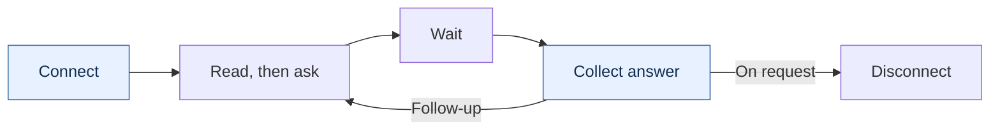

# Persistent terminal handoffs

[Library](../README.md) · [Security and E2EE](security.md) · [Files](files.md)

An invited agent uses its ordinary command tool to connect to an existing browser
terminal. The terminal keeps the handoff records; the connection carries requests
and responses. Collecting an answer does not disconnect it.

**The agent connection is end-to-end encrypted between this page and the
connector.** The hosted or a compatible self-hosted relay forwards ciphertext.
The page and invited agent can read shared output; the agent's tool/chat provider
may receive it too. The relay sees connection metadata, not the decrypted
commands or answers. [Encryption coverage and limits](security.md) explain each
boundary, including the separate shell connection and saved snapshots.

## Invite an agent

1. Open **Invite agent** in the terminal. Choose **Read only** or **Read and run
   commands**. **Connection settings** lets you select a compatible relay.
2. Press **Copy invitation** and paste the complete message into your coding
   agent's chat with your request. The agent needs its ordinary command tool and
   Node.js 22+; no MCP setup or special Shell tool is required.
3. With read-only access, the agent inspects existing output and reports back.
   With command access, it can submit requests, wait and collect answers. Keep
   the connection for follow-ups. **Revoke access** ends it whenever you choose.

Read-only access includes retained terminal output and task results. Command
access additionally permits input in that existing process. Neither grant
automatically shares a file catalog or establishes a WebRTC file connection.



Closing the panel preserves the connection. An unused hosted invitation expires
after five minutes; the grant expires four hours after creation. A disconnected
agent needs a fresh invitation, but can retrieve retained tasks from the same
live terminal. Reloads need host-managed recovery and a live backend process;
a snapshot does not restart the shell. See [what persists](#what-persists).

## Embed a session

```js
import { Terminal, getTerminalSession, getTerminalAgentAccess } from 'refstream.js';
import { attachTerminalTools } from 'refstream.js/ui';

const terminal = new Terminal();
terminal.open(container);
const session = getTerminalSession(terminal);
const tools = await attachTerminalTools({
  terminal, session, toolbar, overlay,
  ui: { toolbar: ['agent', 'menu'] },
});

tools.dispose(); // Removing the view leaves this session and its grant alive.
const state = getTerminalAgentAccess(session).state;
// getTerminalAgentAccess(session).revoke() immediately revokes access.
// terminal.dispose() ends the default session and revokes its grant.
```

The default UI also uses `getTerminalSession()` when no session is supplied.
Explicit `new TerminalSession(terminal)` instances can be supplied to the UI.
Labels, tooltips, toolbar placement and complete panel renderers remain
customizable through `TerminalUiOptions`.

For a host-owned Copy button, use the same session-scoped access controller:

```js
import { getTerminalAgentAccess } from 'refstream.js';

const access = getTerminalAgentAccess(session);

// Call from your explicit Share / Copy action.
async function createInvitation() {
  const invitation = await access.create({
    permission: 'read',
    relayUrl: 'https://mcp.shell.online', // Or your compatible HTTPS relay.
  });
  // Give message to your own private copy UI; do not log or persist it.
  return invitation.message;
}

// Owner action: access.revoke();
// access.onChange(state => updateYourConnectionStatus(state));
```

Browser clipboard permissions may require a separate user click after creation.
Keep the invitation in the current UI only, and surface creation errors. Choosing
another relay changes routing, not the encrypted payload protocol. A custom relay
must implement that protocol and serve the pinned connector, or the host must
explicitly supply its own trusted connector URL and checksum. See
[relay trust](security.md#how-the-agent-connection-works).

## Connect once, reuse the connection

The owner chooses access and copies an invitation from the Agent panel. The copy
contains a standalone Node.js 22+ connector URL and its pinned SHA-256 checksum.
The agent verifies that file, runs `node shell-agent.mjs connect`, and passes the
private invitation on stdin or through the connector's hidden prompt. The private
invitation must never appear in command arguments, shell commands, URLs or logs.

The checksum verifies downloaded bytes against the trusted library's pin. It
does not establish the identity or trustworthiness of the invited agent.

`connect` returns **`sessionId`**, the connector handle. Use that same handle for
`request`, `status` and `stop`. Reads also contain **`terminalSessionId`**, a
different, stable identity belonging to the browser terminal. That identity is
metadata, not a connector handle or an authorization credential.

Each `node shell-agent.mjs request SESSION_ID` takes one JSON request on stdin.
`node shell-agent.mjs status SESSION_ID` resumes access to the current connection
and returns the screen, input guard and retained task summaries.

| Operation | Purpose |
| --- | --- |
| `read`, `tasks` | Inspect the current application and existing handoffs. |
| `ask` | Check the current input and submit one complete prompt with a stable task ID. |
| `read_task` | Retrieve a task, its retained result, current terminal state and next step. |
| `wait_task` | Wait for task progress or optional output changes; return an already-actionable state immediately. |
| `collect_task` | Retain partial output, or collect a completed answer. Leaves the connection open. |
| `cancel_task` | Explicitly abandon a handoff record. Does not interrupt the application. |

For example, with command access at an empty marked shell prompt (replace `12`
with the current sequence from your read):

```json
{"method":"ask","args":{"kind":"command","prompt":"pwd","taskId":"workdir-1","expectedSequence":12}}
```

Wait using the returned task revision, then collect its result:

```json
{"method":"wait_task","args":{"taskId":"workdir-1","afterRevision":1,"timeoutMs":15000}}
```

```json
{"method":"collect_task","args":{"taskId":"workdir-1"}}
```

An already reported `answer_ready`, authentication request, input dialog, or
retained final answer returns immediately, even if its task revision was already
read. Follow `next`: `authenticate`, `inspect`, `collect`, `wait`, or `done`.
`timedOut: true` means the wait expired without new evidence; it never means done.
When application state is `unknown`, inspect the returned screen first: `next:
"wait"` means no structured completion event is available, not that the final
answer is absent. An answer may already have arrived before that read. A control
grant can explicitly collect an observed final answer as described below;
read-only agents can read and report it without changing task state.

For an application without lifecycle reports, pass `afterOutputSequence` from
`read_task.terminal.outputSequence` alongside the task revision. This also wakes
for output that arrived between the read and the wait, including after an earlier
"background job started" acknowledgement. Replace both example numbers with
values from that same read:

```json
{"method":"wait_task","args":{"taskId":"review-1","afterRevision":3,"afterOutputSequence":42,"timeoutMs":15000}}
```

`reason: "output"` means inspect the returned terminal text; it does **not** mark
the task completed. `reason: "state"` means task or actionable host state is
available. `reason: "timeout"` means neither arrived. Update both cursors from
each response. With a reliable host integration, omit the output cursor to wait
for lifecycle events instead of every redraw.

Use a new task ID for a new request. Retrying the same ID and prompt retrieves the
existing task without submitting it again. A new handoff is blocked until the
previous answer is collected or the task is explicitly abandoned. A read-only
grant permits reading and waiting, but cannot submit or change a handoff.

## Completion is explicit

```mermaid
stateDiagram-v2
    accTitle: A handoff remains pending until there is completion evidence
    accDescr: A submitted task waits, or needs attention if its input or progress needs inspection. Explicit evidence completes it; collection retains the result. Cancellation abandons the record without stopping the application.
    [*] --> waiting: ask
    waiting --> needs_attention: Owner input or interrupted submission
    waiting --> completed: Explicit completion evidence
    needs_attention --> completed: Explicit completion evidence
    waiting --> cancelled: Owner or agent abandons task
    needs_attention --> cancelled: Owner or agent abandons task
    completed --> collected: collect_task
    collected --> [*]
    cancelled --> [*]
```



The statuses are `waiting`, `needs_attention`, `completed`, `collected` and
`cancelled`. A sent receipt, output, silence, a redraw, and a background-job
acknowledgement do not establish completion. An attention revision is returned
once; subsequent waits can block for new progress rather than rapidly polling.

Every final result records where its completion claim came from:

- **`shell`**: an explicit OSC 133 completion boundary for this command. The exit
  code is retained; completion does not imply a zero exit code.
- **`host`**: the embedding application called `session.completeTask(taskId,
  answer)` after receiving an actual application completion event.
- **`agent_observed`**: the visiting agent read the final answer and explicitly
  reported it. This is an observation, not independent confirmation by the host.

A generic Claude or other TUI cannot be treated as a structured conversation API.
For such an application, `collect_task` without completion evidence stores an
unconfirmed screen excerpt and leaves the task pending. It may include earlier
context and is marked truncated. After observing the actual requested answer,
the agent can submit `answer`, `completion: "agent_observed"`, and
`expectedTaskRevision` from `read_task.task.revision`. Ordinary output and redraws
do not invalidate this task observation. Local input, task changes, and new host
state do. A host reporting work, authentication, or an input dialog blocks an
observed-completion claim. The result retains the `agent_observed` provenance;
the revision is a concurrency guard, not proof that the answer is correct.

```json
{"method":"collect_task","args":{"taskId":"review-1","expectedTaskRevision":3,"answer":"The colleague's actual final findings.","completion":"agent_observed"}}
```

Collecting an already completed result or retaining current partial output needs
no sequence. Repeating collection returns the same retained answer. The older
`expectedSequence` guard remains accepted for explicitly supplied answers, but
can reject a screen observation after a harmless redraw. New clients should use
`expectedTaskRevision` for observed answers; input still requires a fresh terminal
sequence.

Hosts with a real application integration can report completion directly:

```js
// In the host's actual application-completion callback:
session.completeTask(taskId, finalAnswer);
```

The connector's `stop` refuses to abandon a pending or uncollected handoff.
Keep the connection open for follow-ups. Disconnect only when requested. The
browser owner can always **Revoke access** immediately, including during work.
The explicit `stop SESSION_ID --force` form also permits an intentionally requested
disconnect with unfinished work. Neither action sends Ctrl+C or stops the shell.

## Draft protection

All remote input requires `expectedSequence` from a recent read. Local input is
tracked before PTY echo, including IME composition. Enter requires an agent-owned
draft; another person's intervening input removes that ownership. No draft is
cleared automatically. Prefer `ask` to separate typing and Enter calls.

For an unmarked application composer, `ask` requires `confirmEmptyInput: true`
unless the host has explicitly reported an empty composer. That assertion is for
an agent that inspected and verified the composer is empty. It cannot override a
reported draft or protected local activity. When the agent cannot verify emptiness, it must wait.
Multiline messages require the application's bracketed-paste mode.

An observed keystroke can move a cursor, accept a suggestion or edit a draft. It
does not prove which happened. Reads distinguish `input.state` (`empty`,
`occupied`, `unknown`), `input.content` and `input.protected`. Unverified local
activity stays protected, without claiming the application contains a draft.
`input.screen` adds a bounded cursor-line excerpt and color/dim runs, labeled
`display_only`. A gray line or text after the cursor is evidence to inspect,
never permission to type. Unknown does not mean "ask the owner to clear text."

For an unintegrated TUI, the owner can inspect the actual composer and choose
**I've checked: input is empty**. This calls
`session.confirmInputEmpty(session.input.revision)` without sending or deleting
text. Further input or output invalidates that one-time acknowledgement, which
reads as `verifiedBy: "owner"`. It cannot override a host-reported draft. A real
application integration uses the semantic reports below instead. Neither
reporting method is available to a visiting agent through the relay.

## Application and composer state

Hosts can wire their real application model once with
`attachTerminalApplication`. State notifications read the model synchronously;
completion events retain the final answer and wake waiting agents. The model
must report every editor/lifecycle change, including edits from other clients.
This API does not install a Claude plugin or infer a TUI's state from pixels.

```js
import { attachTerminalApplication } from 'refstream.js';

const binding = attachTerminalApplication(session, {
  getState() {
    return {
      status: application.status,
      taskId: application.acceptedTaskId, // Exact accepted request, not the latest visible task.
      composer: editor.value.length > 0 ? 'draft'
        : editor.suggestion ? 'suggestion'
        : editor.placeholder ? 'placeholder' : 'empty',
    };
  },
  onStateChange: listener => application.onStateChange(listener),
  onTaskComplete: listener => application.onFinalAnswer(({ taskId, answer }) => {
    listener({ taskId, answer });
  }),
});

// Before replacing the application/process:
binding.dispose();
```

Here `application` and `editor` are the embedding host's trusted models.
Subscriptions return `{ dispose() }`; `onTaskComplete` is optional when the
host cannot identify a final answer. Pass only an accepted request's actual task
ID. Do not map arbitrary background-job or stop events to completion. Duplicate
identical final events are harmless, including after collection; a different
answer cannot overwrite an already final result. Binding replacement or
detachment removes subscriptions and revokes live semantic claims. A failed
state read also revokes them and reports the error to the host.

Lower-level integrations can report state directly. Unknown fields, including
composer values or raw hook payloads, are rejected:

```js
// Inside the host's synchronous application-state callback:
const observation = session.observeApplication(); // Capture before observing the application.
const composer = editor.value.length > 0 ? 'draft'
  : editor.suggestion ? 'suggestion'
  : editor.placeholder ? 'placeholder' : 'empty';
session.reportApplicationState({ status: 'ready', composer }, observation);

// Application lifecycle callbacks, associated with the actual current handoff:
session.reportApplicationState({ status: 'authentication_required', taskId }, session.observeApplication());
session.reportApplicationState({ status: 'working', taskId }, session.observeApplication());
session.reportApplicationState({ status: 'answer_ready', taskId }, session.observeApplication());
// Only after the requested answer has actually arrived:
session.completeTask(taskId, finalAnswer);
```

Read the application's **real editor model**, not `terminal.textarea.value`.
The terminal textarea is a keyboard/IME sink, not the TUI's composer. Any typed
prefix counts as `draft`, even when an inline suggestion follows it. No composer
text is included in a report. Only report `placeholder` or `suggestion` when the
editable value is empty; both read as `input.state: "empty"`, `verifiedBy: "host"`.
They need no clearance button or `confirmEmptyInput` assertion.
Reports never grant agent ownership of a draft. A composer report arriving
between paste and Enter stops submission if it changes ownership, preserving
the task for inspection instead of retrying it. Hosts with synchronous editor
callbacks should observe state after the atomic input operation finishes.

A reported composer survives ordinary output/redraws. All terminal input and
IME composition invalidate it, as do reset, restore and a buffer change. The
integration must report every application/composer/context change and call
`session.invalidateApplicationState()` when it detaches. Apply backend events
in order and associate them with the correct process and task. For an asynchronous
observation, retain the token captured **before** observing the host, not a new
token stamped when the response arrives. A token survives output and rendering,
but input, newer host evidence, submission, reset, restore, and detachment
invalidate it. A rejected report requires a fresh observation. The older numeric
sequence argument remains supported and is invalidated by every terminal change.
New confirmations supersede older observations even when their visible state is
identical; they do not manufacture a new task-progress revision. Detachment and
composer-invalidating lifecycle transitions also revoke ownership of earlier
agent input, so an old draft cannot be submitted into a different application.

`read().application` supplies `status`, `source`, `revision` and optional `taskId`.
The default status is `unknown`; it is never inferred from output or silence.
An explicitly marked, idle shell prompt reports `ready` with `source: "shell"`.
That does not identify the state of a TUI running inside that shell. Semantic
application reports use `source: "host"`; unavailable state has `source: null`.

| Application status | Agent behavior |
| --- | --- |
| `authentication_required` | Keep the connection; the owner signs in through the application. Agent writes pause. |
| `working` | Wait for progress; agent writes pause. |
| `answer_ready` | Retrieve the response for the associated task. It has not necessarily been collected or verified complete. |
| `input_required` | Inspect the current dialog; let the owner respond. New prompts are blocked. |
| `ready` | Inspect input readiness before a new request. |
| `unknown` | Inspect available evidence; do not invent an input or completion state. |

Meaningful reports wake `wait_task`, including composer recovery. Authentication
returns `next: "authenticate"`; an associated answer-ready report returns
`next: "inspect"` until an actual answer is retained. Reports never complete a
task by themselves. New asks clear previous lifecycle observations, and snapshots
do not restore live input authorization or application-state claims.

For Claude Code, documented hooks such as `UserPromptSubmit`, `Stop` and
`StopFailure` can inform a **host-owned** lifecycle adapter. They do not provide
the live editable composer value; a stop event also does not prove the requested
work was done. Do not forward raw hook payloads, transcripts or credentials to
the relay. Map only supported states through your existing trusted host
integration. The library does not install hooks or automatically identify every
Claude screen. See [Claude Code hooks](https://code.claude.com/docs/en/hooks).

## What persists

The live connection, terminal state and shell process have different lifetimes:

| Event | Connection | Terminal and task state | Shell process |
| --- | --- | --- | --- |
| Close or remount the Agent panel | Stays connected | Retained in the same session | Unchanged |
| Collect an answer | Stays connected | Result retained, within history limits | Unchanged |
| Revoke, disconnect or grant expiry | Ends; reconnect with a fresh invitation | Retained while that terminal session remains alive | Host-controlled; no automatic interrupt |
| Reload the page | Ends | Host must explicitly save and restore a snapshot | Must still exist in the backend to reattach |
| Dispose the terminal/session | Ends | Live objects end; only host-saved exports remain | Host controls whether to stop it |

Snapshots are data, not encrypted archives or process checkpoints. Task records
include prompts and answers and can be as sensitive as the terminal output.

- The connector survives ordinary command invocations, and the logical session
  survives UI remounts. The hosted grant expires four hours after invitation
  creation; the single-use invitation expires after five minutes. The panel
  distinguishes those lifetimes.
- Task records and answers remain in the live terminal session after an agent
  disconnects. A fresh invitation to that same session can retrieve them without
  resubmitting the task. Used invitations cannot be replayed to reconnect.
- Snapshots retain the logical identity, tasks and terminal state, but never
  relay capabilities or connector credentials. Restored unfinished tasks require
  inspection. Restoring a snapshot does not restart a process.
- Page reload or process restart requires host-managed snapshot storage and a
  live PTY backend to restore a working shell or Claude session. The library does
  not silently persist terminal contents in browser storage or on the relay.
- History retains the last 32 task records, with answers bounded to 32,768
  characters. Expired task IDs remain reserved, including across snapshots, so
  an old retry cannot resubmit a command. A session stops accepting new task IDs
  after 4,096 retired IDs rather than forgetting those reservations.
- The relay sees encrypted payloads. Connector state on disk contains only its
  protected local IPC credentials, never terminal contents, answers or the private
  invitation. Host-saved snapshots contain private terminal data and need the
  same protection as the underlying session.

The protocol has no forward secrecy: disclosing an invitation secret later can
expose recorded ciphertext from that grant. Revocation stops future access, but
does not erase already shared data. See [security and E2EE](security.md) for the
full trust model and [private reporting](../SECURITY.md) for suspected issues.
