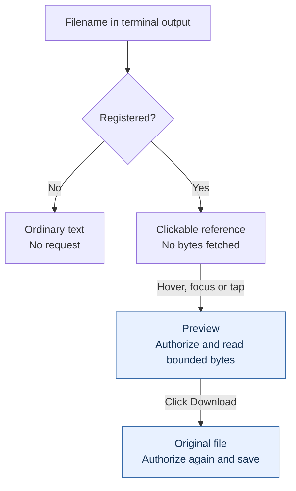
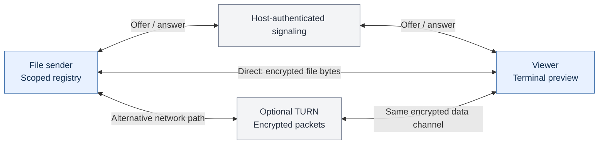

# Files, previews and peer-to-peer streams

[Library](../README.md) · [Agent sessions](agents.md) · [Security and E2EE](security.md)

`refstream.js/files` is the optional file-source module of Refstream.js. It maps
registered references to **Web Streams, Blobs, explicit URLs or WebRTC streams**.
Use it with Refstream's terminal previews or your own interface. It has no runtime
dependencies, UI framework, automatic network connections or filesystem access.

This is an alpha library. Browser JavaScript and npm distribution formats are built and tested here; the npm package has not been published yet.

File sharing is separate from agent access. An agent invitation does not create
a file connection. WebRTC encrypts file bytes between the peers; URL and custom
stream sources use the transport supplied by the host. See
[which connection is encrypted](security.md#which-connection-is-encrypted).

## Load JavaScript

Copy `dist/browser/` to your static host, keeping `chunks/` beside the modules:

```js
import { FileRegistry, fileLinks, createFilePeer } from '/vendor/refstream/files.js';
```

Or load `files.global.js` with a regular script tag and use `window.RefstreamFiles`. No bundler or installer is required. Serve JavaScript with its correct MIME type; permit cross-origin module loading only if needed. Run `npm ci && npm run build` to produce the browser files. Keep the MIT license with them.

For a bundler, install a tarball produced with `npm pack` in a built checkout,
then use the package import. There is no separate files package to install:

```js
import { FileRegistry, fileLinks, createFilePeer } from 'refstream.js/files';
```

The examples below use package imports. For direct browser modules, substitute
`/vendor/refstream/files.js` as in the first example. Container elements, backing
Blobs and authenticated signaling callbacks belong to your application.

## Register actual sources

Only explicit registrations can become file links. Detection and `has()` are local lookups; they never open a stream or fetch a URL.



```js
import { FileRegistry } from 'refstream.js/files';

const files = new FileRegistry({
  allowedOrigins: ['https://files.example.com'],
});

files.add('README.md', { body: '# Project notes\n' });
files.add('report.pdf', { body: reportBlob, mimeType: 'application/pdf' });
files.add('build.log', {
  mimeType: 'text/plain',
  // Return a fresh ReadableStream<Uint8Array> each time.
  stream: ({ signal, purpose }) => openAuthorizedLogStream({ signal, purpose }),
});
const registration = files.add('plots/results.png', {
  url: 'https://files.example.com/opaque-file-id',
  mimeType: 'image/png',
  preview: { body: thumbnailBlob },
  // Check permissions again for every preview and download.
  authorize: ({ purpose }) => sessionMayReadFile('opaque-file-id', purpose),
});

// Withdrawal removes detection and cancels active reads.
registration.dispose();
// On application/session teardown:
files.dispose();
```

Supply exactly one backing per file (and per optional preview): a string/Blob `body`, a `stream` factory, or an absolute HTTP(S) `url`. A preview can be a smaller image, a text excerpt or another supported file. Without a separate preview, previews read the normal backing under their own byte limit.

URL sources require an exact origin allowlist and are fetched without cookies, credentials, referrers, redirects, or caching. For authenticated HTTP endpoints, supply your own stream factory that authorizes the user, session and file on every request. **Never construct a fetch URL or filesystem path from detected text.** Register the mapping from a trusted application catalog.

Use HTTPS for remote URL sources. An allowed origin permits a request; it does
not hide the file from the provider serving it. `authorize` and the backing
backend both belong to the host's access model. A browser callback alone cannot
secure a public storage URL.

## Connect a terminal or your own UI

```js
import { fileLinks } from 'refstream.js/files';

// An existing Refstream Terminal instance:
terminal.options.fileLinks = {
  ...fileLinks(files),
  hoverDelayMs: 300,
  ui: { actions: ['download', 'close'] },
};
```

The adapter supplies local availability, resolution and change events. Adding or withdrawing a source updates links automatically; a revoked preview closes. Only registered paths link. The terminal owns its customizable preview/download UI; the files module owns the file sources.

Hover or keyboard focus previews a reference; clicking or tapping pins it open.
Text stays plain text, supported images/video use browser media elements, and
active documents are not executed. Unsupported formats still have Download.
The browser's codec support determines which videos can play.

The [file UI options](../src/file-preview.ts) let a host replace actions, labels,
tooltips, preview content or the complete popover. Set
`terminal.options.fileLinks.download(reference, { signal })` to integrate an
embedded browser's native save bridge. This host callback must authorize the
file again and enforce its own read limits before saving. The default
save path uses a Blob download and remains subject to the browser's download
policy; it is not a filesystem API. A save callback must surface failure rather
than resolve successfully without saving the bytes.

For another interface:

```js
import { detectFiles } from 'refstream.js/files';

const matches = detectFiles('Created plots/results.png and README.md:4', files);
// Each match has start/end UTF-16 offsets, text, file metadata, and optional line/column.

const abort = new AbortController();
const file = await files.resolve('README.md', {
  purpose: 'download',
  signal: abort.signal,
});
if (file) await file.body.pipeTo(yourWritableStream);
// Or consume with new Response(file.body).text()/blob() for bounded small files.
// AbortSignal or file.body.cancel() cancels the upstream read.
```

Render names and text as text, not HTML. `detectFiles()` matches only explicitly registered references, including filenames with spaces and `:line:column`, `#LlineCcolumn`, or `(line,column)` suffixes. It bounds work to 8,192 UTF-16 code units, 256 registered files and 32 results. It does not discover files or grant permission. `list()` exposes display references and metadata, never backing URLs or file contents.

## Peer-to-peer streams

File bytes travel over an encrypted WebRTC data channel. Your application authenticates the two peers and exchanges the offer and answer through its existing HTTPS/WebSocket signaling. No signaling service, STUN server or TURN server is hardcoded into the library.



The two endpoints can read the shared files. A TURN forwarder cannot decrypt
their data channel, but sees connection metadata. Trusted signaling identifies
the intended peer; substituting an offer or answer can connect a different peer.
Descriptions can expose network addresses, so treat them as private session
metadata. WebRTC encryption does not replace peer authentication or file access
checks. Interrupted transfers do not resume automatically.

On the computer/browser sharing files:

```js
import { createFilePeer } from 'refstream.js/files';

const sender = createFilePeer({
  files: filesForThisAuthorizedViewer,
  rtcConfiguration: yourRtcConfiguration,
});
try {
  const offer = await sender.createOffer();
  // Host-defined request: deliver only to the authorized viewer.
  const answer = await authenticatedSignaling.exchangeOffer(offer);
  await sender.acceptAnswer(answer);
  await sender.ready;
} catch (error) {
  sender.dispose();
  throw error;
}
```

On the viewing page:

```js
import { createFilePeer, fileLinks } from 'refstream.js/files';

const viewer = createFilePeer({ rtcConfiguration: yourRtcConfiguration });
try {
  const answer = await viewer.acceptOffer(offerFromAuthenticatedSender);
  await authenticatedSignaling.sendAnswer(answer);
  await viewer.ready;
  terminal.options.fileLinks = fileLinks(viewer);
} catch (error) {
  viewer.dispose();
  throw error;
}

// On disconnect/unmount: viewer.dispose(); sender.dispose();
```

Each peer advertises only its explicitly supplied registry. Create a separate scoped registry when viewers have different permissions. The receiving peer resolves detected references locally against that catalog, then requests the registered opaque file ID. Backing URLs, authentication credentials and unregistered paths never enter the file protocol. `authorize` still runs on the sender for every preview/download.

Offer/answer exchange is **application code**, not a built-in agent tool. Bind signaling to authenticated users and sessions, and do not log or publicly expose descriptions; connection descriptions can contain network addresses. WebRTC encrypts transport but does not replace your application’s authorization. For internet use, explicitly configure your own STUN/TURN infrastructure; some networks require TURN, which relays encrypted traffic. The empty default supports direct connectivity where available. Failed connections fail explicitly; the library never silently uploads a file or falls back to a URL.

If your app already has WebRTC, use `new FileChannel(dataChannel, { files })`. Create the channel with `{ ordered: true, protocol: FILE_CHANNEL_PROTOCOL }` and default reliability. Both endpoints must attach a `FileChannel` before exchanging traffic.

## Bounds and lifecycle

| Option | Registry default | Peer/channel default |
| --- | --- | --- |
| `maxPreviewBytes` | 16 MiB | 16 MiB |
| `maxDownloadBytes` | 128 MiB | 128 MiB |
| `timeoutMs` | 60 seconds idle | 30 seconds idle |
| Concurrency | `maxConcurrentReads: 8` | `maxConcurrentTransfers: 4` in each direction |
| Catalog size | `maxFiles: 256` | 256 shared files |
| `connectionTimeoutMs` | — | 30 seconds, including signaling |

Preview limits can be configured up to 128 MiB; download limits up to 1 GiB. Actual streamed bytes enforce the cap regardless of size metadata. Stream factories should emit moderate chunks; the sender retains at most one upstream chunk per transfer and sends one binary message (at most 16 KiB) for each consumer credit. Readers that stop consuming must cancel the stream, or the idle timeout will release it. Slow consumers never create an unbounded output queue.

The terminal's preview UI has its own, lower limits: 8 MiB previews and 64 MiB
downloads by default, configurable up to 16 MiB and 128 MiB respectively. The
effective limit is the smaller limit along the read path. Larger downloads
through the headless API need a host-owned streaming destination, rather than
raising a limit and buffering the whole file in a tooltip.

Registry disposal withdraws sources and aborts active reads. Peer/channel disposal cancels transfers and closes its connection; it does not dispose an application-owned registry. Connection loss fails outstanding reads. Reconnection and retry require a new peer and freshly authorized stream; there is no silent resume or persistent storage. `FileAccessError.code` reports `UNAVAILABLE`, `DENIED`, `LIMIT`, `ABORTED`, `TIMEOUT`, `DISCONNECTED`, or `PROTOCOL`, without exposing source exception details.

The library uses standard Web Streams, `fetch`, AbortController and WebRTC data channels. Serve peer connections from HTTPS or localhost. Automated browser tests exercise Chromium, Firefox, WebKit and mobile browser profiles; physical devices, internet NAT traversal and your own TURN infrastructure need deployment-specific verification.

Neither snapshots nor recordings retain resolved preview bytes or backing
objects. A filename or URL printed in terminal output is still retained as text.
Downloaded files are ordinary plaintext artifacts; their storage and sharing
are controlled by the host and user.

## Build and verify

```sh
npm ci
npm run build
npm test
npm run test:package
```

Use Node.js 22 or newer for development. The package contains ESM, CommonJS, standalone browser JS and TypeScript declarations, with no runtime dependencies or install-time compilation. An isolated consumer test verifies the packaged artifacts without source files.

For real WebRTC and browser distribution tests:

```sh
npx playwright install chromium firefox webkit
npm run test:browser
```

Tests include Chromium, Firefox, WebKit, mobile browser profiles, and Chromium-to-Firefox/WebKit transfers. The file submodule is headless; the main Refstream.js module provides the terminal renderer. The browser fixture exercises its public API. Nothing is published to npm by these commands.

Build output belongs in `dist/`; it is not committed. CI verifies packaging on Linux, macOS and Windows, plus real browser transfers.

Keep stable version paths immutable. Self-host with any static server or CDN, correct JavaScript MIME types, `nosniff`, and explicit CORS policy. Return 404 for missing modules instead of an HTML application fallback. No worker or backend is required for file registries; P2P deployment needs your authenticated signaling and any configured ICE services.

Protocol references: [WebRTC data channels](https://www.w3.org/TR/webrtc/#rtcdatachannel), [Web Streams](https://streams.spec.whatwg.org/).

The optional file submodule has no dependency on the renderer, a hosted relay, or Cloudflare. The main [Refstream.js library](../README.md) provides the terminal emulator. Licensed under [MIT](../LICENSE).

See [security and E2EE](security.md) for the complete trust boundary and
[private vulnerability reporting](../SECURITY.md) for suspected issues.
