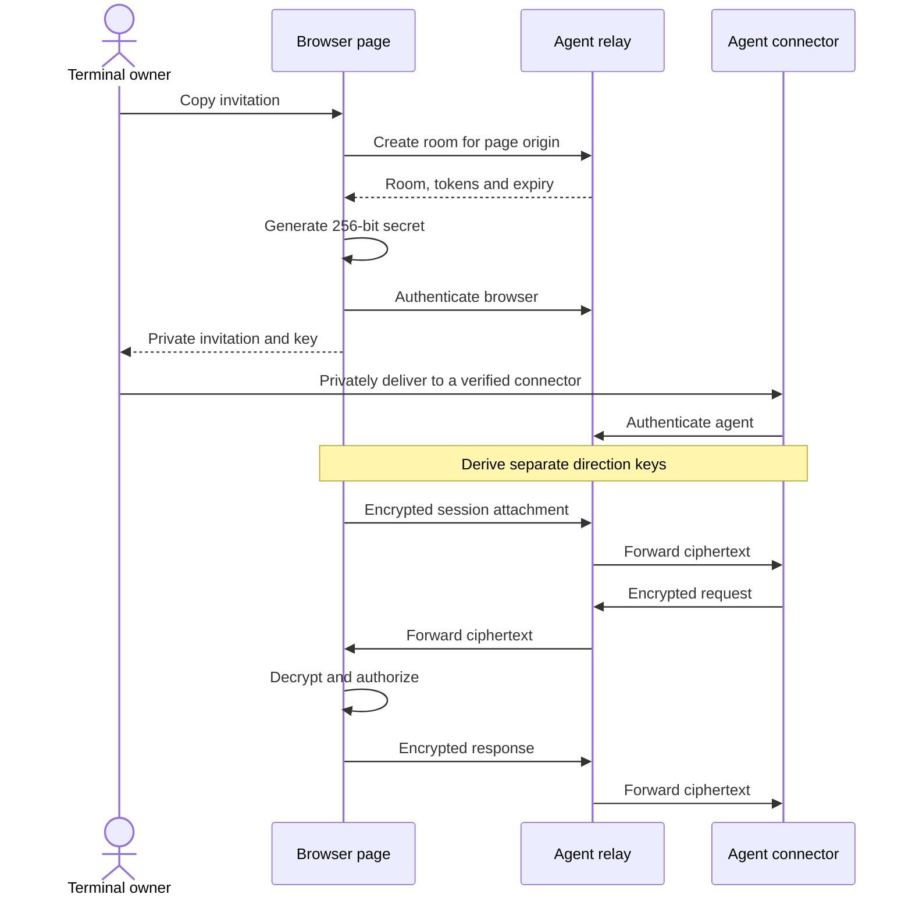

# Security and end-to-end encryption

[Library](../README.md) · [Agent sessions](agents.md) · [Files and streams](files.md)

**Refstream's agent connection is end-to-end encrypted between the browser page
and the invited agent's connector.** Commands, terminal output, task prompts,
answers and session responses are encrypted before they reach the agent relay.
The relay forwards ciphertext and does not receive the encryption key.

The page and connector are the endpoints. Both can read what they share. An
invited agent, its execution environment and any chat/model provider receiving
that data are outside the relay confidentiality boundary. The private invitation
itself contains the key: treat the copied message as a secret.

This document describes the current alpha implementation. It is not a claim of
an independent security or cryptographic audit.

## Which connection is encrypted?

| Connection or artifact | Protection | Who can read the contents? |
| --- | --- | --- |
| Page ↔ agent connector, through the hosted or a compatible custom relay | Application-level AES-256-GCM inside HTTPS/WSS; no plaintext fallback | Page, connector and the invited agent that receives its results |
| Local command invocation ↔ background connector | Separately keyed, authenticated encryption over loopback IPC | Processes with access to the connector's private state and the user's account |
| File sender ↔ file viewer, through `createFilePeer()` | WebRTC data-channel encryption; application-authenticated signaling identifies the intended peers | The two file endpoints; a TURN forwarder does not decrypt their file bytes |
| An explicitly registered file URL | HTTPS when the registered URL uses HTTPS; no extra Refstream E2EE layer | The file provider and the requesting endpoint |
| Page ↔ shell/PTY backend | Defined by the embedding application | Defined by that application's transport and backend |
| Snapshot, recording or downloaded file | No automatic at-rest encryption | Whoever can access the saved bytes |

Importing the library does not connect to a relay, enumerate files, start a shell
or send telemetry. A host explicitly enables the network features it uses. A
terminal renderer alone cannot make an arbitrary backend connection E2EE.

## How the agent connection works

The relay issues **admission tokens** to decide which two sockets can join a
room. The page generates a different **encryption secret** using Web Crypto's
random generator. Only the private invitation carries that secret to the agent.
The room-creation request contains the page origin, not the encryption secret.
Admission and decryption are separate operations.

The invitation is a `shell-invite-v1.…` string, deliberately not a navigable URL.
It is encoded, **not encrypted**: anyone holding it has its key and agent
capability. Keep it out of command arguments, shell history, URL previews,
analytics, logs and public issues. The connector accepts it on stdin or through
a hidden interactive prompt. Clipboard and chat history remain part of the
user's chosen delivery channel; Refstream cannot erase their copies.

The standalone connector URL and SHA-256 checksum come from the trusted terminal
library. Verify the downloaded bytes against that pin before execution. A
checksum fetched from the same untrusted download location is not a substitute.
Hosts overriding `client: { url, sha256 }` or `ui.agentClient` choose and trust
their own connector code and pin. HTTPS and the trusted page's code delivery are
still essential: a compromised page can read both plaintext and invitations.

## What the relay sees

| Visible to the relay or its network infrastructure | Not disclosed by the agent relay protocol |
| --- | --- |
| IP addresses, page origin, room ID, peer role and connection lifetime | Commands, output, task prompts, retained answers and application state |
| Admission tokens during creation/authentication; token hashes in room state | The invitation's separate encryption secret and derived payload keys |
| Frame lengths, public counters, timing and traffic patterns | Decrypted terminal/session responses and encrypted attachment metadata |

The reference relay forwards encrypted frames without storing a terminal
transcript or replay history. Room state contains admission and expiry metadata.
This does not mean infrastructure stores nothing: Cloudflare, a reverse proxy
or a self-hosted operator can retain network metadata or record ciphertext.
E2EE protects the payload even though TLS terminates at that infrastructure.
It does not hide the existence of a connection or prevent traffic analysis.

An agent grant shares the retained data available through that terminal's APIs,
which can include earlier output and handoffs, not just text printed after the
invitation. Read-only prevents remote input; it is not a redaction filter.
Terminal output remains untrusted data, including text that resembles instructions.

## Protocol details

The [cipher implementation](../src/relay.ts) uses the platform Web Crypto API:

| Property | Agent relay protocol v1 |
| --- | --- |
| Initial secret | 32 random bytes generated by the browser for each fresh invitation |
| Key derivation | HKDF-SHA-256; separate 256-bit AES keys for `sender:browser` and `sender:agent` |
| Derivation context | Salt is UTF-8 `shell-terminal-relay-v1\n<room>\n<origin>`; info is the sender label |
| Payload encryption | AES-256-GCM with a 128-bit authentication tag |
| Frame | Version byte `1`, 64-bit big-endian counter, ciphertext, GCM tag |
| Nonce and authenticated header | 96-bit IV: four zero bytes followed by the counter; the nine-byte version/counter header is authenticated as AAD |
| Ordering | Each direction starts at counter `1`; the receiver requires exactly the next counter |
| Connection reuse | One socket per role per room. A disconnected connection needs a fresh invitation and fresh keys |

Direction-specific keys prevent the two counter sequences from sharing a GCM
key/nonce pair. Binding derivation to the room and origin separates sessions.
Tampered, replayed, reflected, reordered or wrong-context encrypted messages fail
verification at the receiving endpoint and close the connection. The relay checks
frame shape and limits; it does not possess the key to verify the GCM tag itself.
Queues and frame sizes are bounded, and cryptographic failure never downgrades
to plaintext.

**There is no forward secrecy or in-session key ratchet in this protocol.** A
later disclosure of the invitation secret can decrypt recorded ciphertext from
that grant. Expiry and revocation end access; they do not make a copied key or
already retrieved output disappear. Re-pairing creates fresh independent keys,
but does not change that limitation for an earlier connection.

The primitives are specified by [Web Crypto](https://www.w3.org/TR/webcrypto/)
and [HKDF, RFC 5869](https://www.rfc-editor.org/rfc/rfc5869.html). Using standard
primitives does not by itself establish the security of the surrounding protocol.

## Access, expiry and persistence

The default UI grants read-only access. Running commands requires the owner's
explicit control grant. Control acts with the permissions of the existing
shell/application, including any files or programs it can access. The page
enforces that permission after decrypting each
request; the reference connector also checks it. The relay is not the authority
that decides which terminal actions are allowed.

The reference hosted relay uses these lifetimes:

| Item | Lifetime |
| --- | --- |
| Unused Copy invitation | Five minutes; single use |
| Connected grant | Expires four hours after invitation creation |
| WebSocket admission | Must authenticate within five seconds |
| UI panel | May close/remount without ending the live grant |
| Page or connector connection | Closing either ends the grant; reconnect with a fresh invitation |
| Task records | Stay in the live terminal session after a connection ends |

The UI reads expiry timestamps from the relay. A custom relay's reported lifetime
must not be assumed identical. **Revoke access** closes the grant immediately;
it cannot undo input already delivered or erase data the agent has collected.
Neither revocation nor connector disconnection terminates the shell process.
The host owns that process's lifecycle.

The connector keeps the relay key in memory. Its private per-user state file
contains a separate local IPC key, port and connector handle, not the invitation
or terminal transcript. The state file is removed on normal connection shutdown;
an abrupt process/OS failure can leave a stale file. User-account permissions and
private directories matter; Unix mode checks do not replace Windows account ACLs.

Snapshots and recordings are opt-in and contain private terminal data. They
exclude relay capabilities, keys and resolved preview objects. Text printed by
an application, including a secret URL or filename, remains ordinary terminal
output and can be retained. See [what persists](agents.md#what-persists) for
reload recovery, replay and retention limits.

## Files have a separate trust boundary

File detection is a local lookup in a host-supplied catalog, not permission to
read a filesystem or contact a URL. Preview and download each reauthorize the
registered backing. No file bytes or backing URLs are added to the agent relay
protocol by enabling previews.

`createFilePeer()` uses an encrypted WebRTC data channel, directly between the
file endpoints or through explicitly configured TURN infrastructure. The host
must authenticate signaling and bind the offer/answer to the intended users and
session. A signaling party that can substitute peer descriptions can redirect a
connection; transport encryption alone does not establish a person's identity.
Peer descriptions can disclose network addresses. Peers see the shared catalog
and the bytes they are authorized to request. A TURN server forwards encrypted
traffic; it still sees network metadata. See the
[file transfer guide](files.md#peer-to-peer-streams) and
[WebRTC specification](https://www.w3.org/TR/webrtc/#privacy-and-security-considerations).

URL-backed files use the host's explicit origin allowlist and omit ambient
credentials, referrers and redirects. HTTPS protects the request in transit, but
the provider serves and sees the plaintext. Custom stream factories define their
own transport and authorization. Use HTTPS for remote sources; the registry's
explicit support for HTTP URLs is not an encryption guarantee.

## Trust and remaining limits

The page's scripts, browser extensions with page access, the connector, the host
account and the invited agent are trusted endpoints. E2EE does not protect data
from a compromised endpoint or from an authorized recipient copying it. There
is no built-in verified agent identity, public-key directory or key-fingerprint
comparison: private invitation delivery authorizes the recipient. Someone who
steals an unused invitation may race the intended agent to connect.

The relay can deny, delay or cut off service. It cannot produce accepted modified
payloads without the encryption key, but encryption cannot guarantee delivery.
After uncertain delivery, inspect retained task state and reuse the original
task ID rather than submitting the command again under a new ID.

The optional MCP adapter's **relay mode** uses the same encrypted payload
protocol, with a companion-generated secret passed in a private URL fragment.
Its legacy **local popup mode** uses a different loopback/postMessage transport;
the agent-relay AES-GCM claim must not be applied to that adapter automatically.
The normal Copy invitation flow uses the standalone encrypted connector.

## Implementation and reporting

- [Invitation creation and connector pinning](../src/invitation.ts)
- [Key derivation, frames, counters and relay connections](../src/relay.ts)
- [Decrypted request validation and read/control enforcement](../src/mcp.ts)
- [Session state and guarded input](../src/session.ts)
- [File source authorization](../src/files/registry.ts) and [WebRTC peer setup](../src/files/peer.ts)
- [Private vulnerability reporting](../SECURITY.md)

Automated tests cover tampering, wrong contexts, replay, role capabilities,
expiry, permissions, draft protection and bounded file reads across the library
and reference relay suites. Browser coverage and passing tests are evidence of
those checks, not a substitute for an independent audit.
